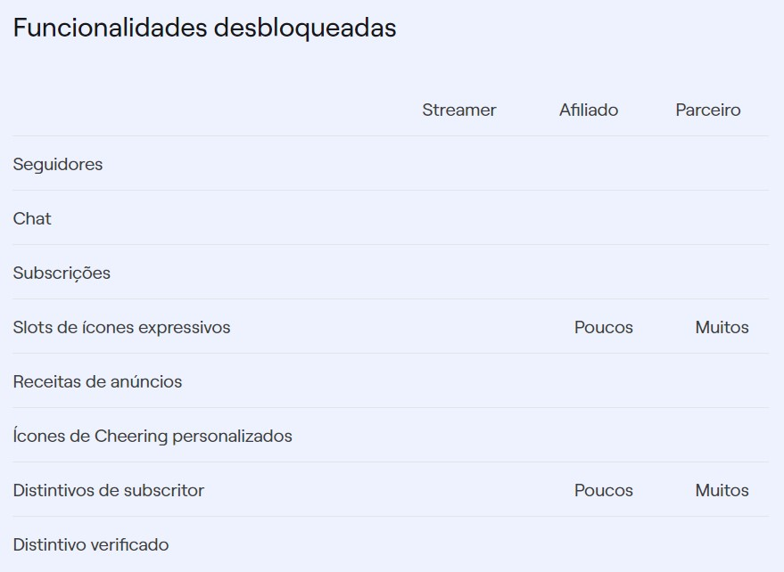
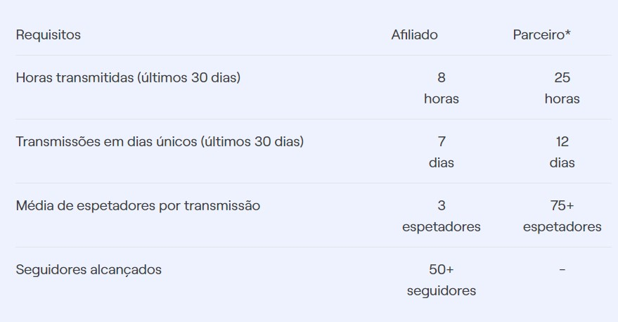

# Observação

## 1. Introdução

A Análise Documental é uma técnica de recolha de dados que abrange diversos tipos de documentos, também pode ser utilizada como técnica complementar de entrevistas, questionários e observação.

O Documento analisado é um artefato produzido pela Twitch de introdução a plataforma.

## 2. Metodologia

Para a realização dessa técnica, lemos o artefato chamado "Crator Camp" para entender as funcionalidades que a Twitch provê aos usuários criadores de conteúdos, vulgo Streamers.

## 3. Resultados

### Legendas

- DOC: Documentação
- RF: Requisito Funcional
- RNF: Requisito Não Funcional  

| Identificador | Requisitos | Tipo |
| --------------| ---------- | ---- |
| 
DOC01
 | Possibilidade de fazer uma transmissão ao vivo seja de um PC, Mac, Xbox, Playstation ou Celular | RF
| 
DOC02
 | Acesso a funcionalidades como chat e análise no Painel de Controle | RF
| 
DOC03
 | Progressão de Streamer para Afiliado e, em seguida, para Parceiro, com requisitos específicos em relação a horas transmitidas, transmissões em dias únicos, média de espectadores e seguidores alcançados | RF
| 
DOC04
 | Disponibilização de ótimas ferramentas aos Afiliados e Parceiros, como um botão de subscrição, ícone expressivo personalizado, receitas de anúncios, distintivos de subscritor e mais oportunidades de receita  | RF
| 
DOC05
 | Possibilidade de submeter um formulário de candidatura a Parceiro através do painel de controle | RF
| 
DOC06
 | Desbloqueio de funcionalidades como seguidores, chat, subscrições, ícones expressivos, distintivos de subscritor e receitas de anúncios, com a quantidade de funcionalidades desbloqueadas aumentando à medida que o streamer avança de Streamer para Afiliado e Parceiro | RF
| 
DOC07
 | Cumprimento de requisitos específicos para avançar de Streamer para Afiliado e Parceiro, incluindo horas transmitidas, transmissões em dias únicos, média de espectadores e seguidores alcançados | RNF
| 
DOC08
 | Dificuldade em atingir o estatuto de Parceiro | RNF
| 
DOC09
 | Necessidade de criar uma ligação com o público e tornar o canal mais rentável para ter sucesso como criador na Twitch | RNF
| 
DOC10
 | O sistema deve possuir resposta rápida para ações como carregamento de lives, mensagens no chat e interações de usuário. com um tempo de resposta médio de menos de 2 segundos| RNF 
|
DOC11
|A plataforma deve ser capaz de aguentar inúmeros usuários e streamers usando a plataforma de forma concorrente, escalando horizontalmente o número de recursos| RNF 
|
DOC12
|A plataforma deve minimizar latência entre usuários e viewers, garantindo que o delay seja menor que 10 segundos| RNF 
|
DOC13
|O sistema deve ser capaz de lidar com picos de acesso, como grandes eventos ou lançamentos, sem degradação significante| RNF 
|
DOC14
|A plataforma deve suportar vídeos em alta resolução, permitindo ao streamer realizar trasmissões acima de 4K, enquanto provê aos usuários a opção de adaptar a resolução de acordo com a conexão| RNF 
|
DOC15
|A plataforma deve permitir o playback de vídeos, sem bufferização ou interrupções, mesmo em alta demanda| RNF 
|
DOC16
|A plataforma deve ser compatível com uma ampla variedade de navegadores e dispositivos, incluindo navegadores populares como Google Chrome, Mozilla Firefox, Safari e Microsoft Edge, além de dispositivos desktop, laptops, smartphones e tablets.| RNF 
|
DOC17
|A plataforma deve funcionar em diferentes sistemas operacionais, como Windows, macOS e Linux, garantindo uma experiência consistente para os usuários, independentemente do sistema operacional que estão utilizando.| RNF 
|
DOC18
|Integração com Plataformas Externas: A Twitch deve fornecer APIs e recursos que permitam a integração fácil com outras plataformas e serviços externos, como sistemas de gerenciamento de conteúdo, ferramentas de streaming, serviços de pagamento e redes sociais.| RNF 
|
DOC19
|A plataforma deve ser acessível para usuários com necessidades especiais, incluindo suporte para tecnologias assistivas, como leitores de tela, recursos de alto contraste e legendas para pessoas com deficiência auditiva.| RNF 
|
DOC20
|A plataforma deve ser adaptável a diferentes regiões geográficas, suportando múltiplos idiomas, formatos de data/hora e preferências culturais específicas de cada região.| RNF 
|
DOC21
|A plataforma deve estar disponível para acesso e utilização pelos usuários durante a maior parte do tempo, minimizando períodos de inatividade não programada.| RNF
|
DOC22
|Caso ocorram falhas, a plataforma deve ser capaz de se recuperar de forma rápida e automática, garantindo que os usuários possam retomar suas atividades sem interrupções significativas.| RNF
|
DOC23
|A plataforma deve garantir a proteção dos dados dos usuários, prevenindo acessos não autorizados, ataques cibernéticos e vazamentos de informações confidenciais.| RNF
|
DOC24
|A plataforma deve ser capaz de lidar com um aumento na demanda e no número de usuários, garantindo um desempenho estável mesmo em períodos de pico de tráfego.| RNF
|
DOC25
|Todas as transações financeiras realizadas na plataforma devem ser protegidas e garantidas contra falhas ou corrupção de dados.| RNF

<h6 align = "center"> Tabela 1: Requisitos levantados utilizando a técnica da Observação. </h6>
<h6 align = "center"> Fonte: Autores </h6>

<h6 align = "center"> Imagem 1: Funcionalidades desbloqueadas conforme o nível do Streamer. </h6>
<h6 align = "center"> Fonte: Twitch </h6>

<h6 align = "center"> Imagem 2: Requisitos para chegar ao status de Parceiro. </h6>
<h6 align = "center"> Fonte: Twitch </h6>

## 4. Referências

> - Engenharia de Requisitos: Software Orientado ao Negócio. **Carlos Eduardo Vazquez**, **Guilherme Siqueira Simões**
> - Creator Camp. **Twitch**. Disponível em: <https://www.twitch.tv/creatorcamp/pt-pt/paths/getting-started-on-twitch/twitch-101/>
> Twitch Engineering Blog

## 5. Histórico de Versão

| Versão | Data | Descrição | Autor(es) | Revisor(es) |
|---|---|---|---|---|
| 1.0 | 08/05/2023 | Criação e desenvolvimento do artefato | Matheus Phillipo | Brunna |

<h6 align = "center"> Tabela 2: Histórico de Versões
 Autor(es): Matheus
 Fonte: Autor(es)</h6>