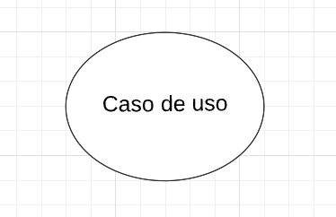
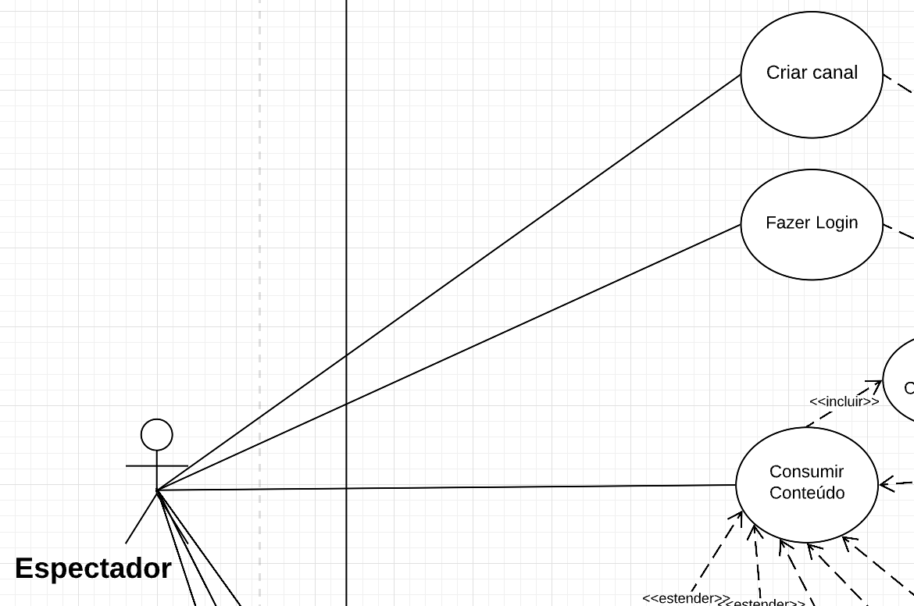
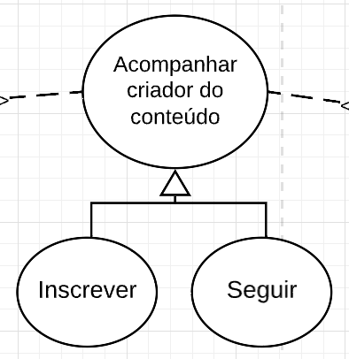
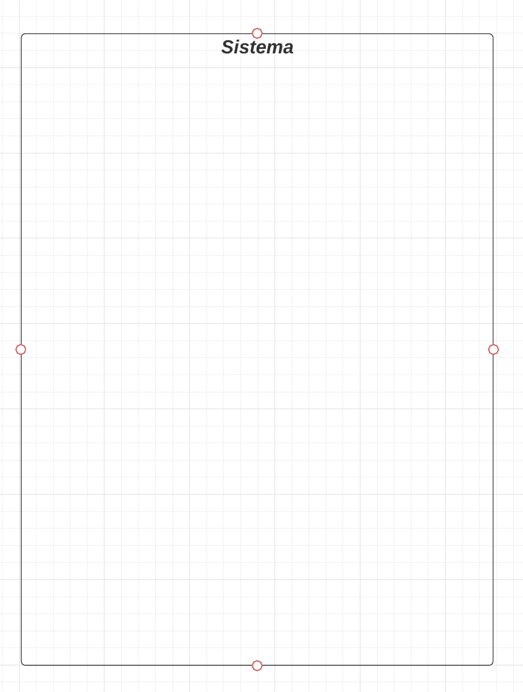

## 1. Introdução
Um diagrama de caso de uso UML tem como objetivo indicar as diferentes possibilidades que um usuário pode se comunicar ou interagir com um sistema específico. Em UML, um diagrama de caso de uso mostra de forma resumida as interações entre usuários de um sistema (ou atores) e o próprio sistema, bem como as metas que o sistema auxilia os atores a atingir e o escopo desse sistema.

Dada a simplicidade desse modelo, sua utilização e sua funcionalidade está dentro do escopo de: representar metas de interação sistema-usuário; definir requisitos funcionais de um sistema; especificação de contextos e requisitos do sistema; modelagem do fluxo básico de eventos que um sistema deve ser capaz de realizar.

## 2. Metodologia

Para elaborar esse artefato, o grupo decidiu representar os casos de uso por meio de um diagrama UML, seguindo os passos dos materiais e fontes fornecidos em sala de aula. A software empregado para construir o diagrama foi o LucidChart.

## 3. Legenda do Diagrama de Caso de Uso

A Tabela 1 a seguir descreve os elementos visuais utilizados no diagrama de caso de uso.

| Nome | Símbolo | Descrição | 
| ------ | ----------- | -----------  |
| Caso de Uso |  | Cada caso de uso representa uma ação que realiza uma tarefa dentro do sistema. |
| Ator(es) |  |  Representam as pessoas que utilizam os casos de uso, sejam elas atores primários (inicia a utilização do sistema, posicionados à esquerda) ou atores secundários (reagem à utilização do sistema, posicionados à direita).  |
| Associações |  | Descrevem os relacionamentos simples entre atores e casos de uso. Os atores se comunicam com os casos de uso ou interagem com os casos de uso. |
| Inclusões |  | Descreve o relacionamento entre um caso de uso base e um caso de uso incluído. O caso de uso base depende de um caso de uso incluído para estar completo, mas não é o ator que desempenha essa tarefa. A seta tracejada tem origem no caso de uso base e aponta para o caso de uso incluído. |
| Extensões |  | Descreve o relacionamento entre um caso de uso base e um caso de uso estendido. O caso de uso base, ao ser inicializado pelo ator, pode ou não resultar na ocorrência do caso de uso estentido; ou seja, o caso de uso estendido acontece apenas se certos critérios forem cumpridos na realização do caso de uso base. A seta tracejada tem origem no caso de uso estendido e aponta para o caso de uso base. |
| Generalização ou Herança |  | Descreve o relacionamento entre atores distintos ou entre casos de uso distintos. Um caso de uso especializado herda todas as características de um caso de uso geral, isto é, um caso de uso secundário herda as características de um caso de uso primário. A mesma dinâmica ocorre entre atores especializados, que herdam todas as características de um ator geral. |
| Caixa de limite do sistema |  | Retângulo que delimita o escopo do sistema. Casos de uso fora do retângulo estão fora do escopo do sistema descrito. |
<h6 align = "center"> Tabela 1: Legenda do Diagrama de Caso de Uso
  Autor(es): Brunna Louise, Diógenes Dantas
 Fonte: Autor(es)</h6>

## 4. Diagrama de Caso de Uso

{: id="Diagrama de Casos de Uso"}
<h6 align = "center">Figura 1: Diagrama de Casos de Uso
 Autor: Diógenes e Brunna
 Fonte: Autor(es)</h6>

## 5. Especificações de Caso de Uso

## 6. Referências

> Diagrama de caso de uso UML: O que é, como fazer e exemplos, pela equipe do Lucidchart. Acesse o site com o tutorial nesse [link](https://www.lucidchart.com/pages/pt/diagrama-de-caso-de-uso-uml). Acesso em 25 de abril de 2023.

> O que é UML e Diagramas de Caso de Uso: Introdução Prática à UML. Acesse o site com o tutorial nesse [link](https://www.devmedia.com.br/o-que-e-uml-e-diagramas-de-caso-de-uso-introducao-pratica-a-uml/23408). Acesso em 13 de maio de 2023.

> Tutorial de Caso de Uso UML. [link](https://www.youtube.com/watch?v=ab6eDdwS3rA). Acesso em 13 de maio de 2023.

## Histórico de Versões

A Tabela 2 registra o histórico de versão desse documento.

|**Data** | **Versão** | **Descrição** | **Autor** | **Revisor** |
|:---: | :---: | :---: | :---: | :---: |
| 11/05/2023 | 1.0 | Primeira Versão do artefato de Use Case (Caso de Uso) | Brunna Louise, Diógenes Dantas | Milena Beatriz, Rafael Nobre |
| 14/05/2023 | 1.1 | Adição de metologia e algumas legendas do Diagrama de Caso de Uso | Brunna Louise, Diógenes Dantas | Milena Beatriz |
| 15/05/2023 | 1.2 | Adição do Diagrama de Casos de Uso e novas imagens da Legenda do Diagrama de Caso de Uso | Diógenes Dantas | Brunna Louise |

<h6 align = "center"> Tabela 2: Histórico de Versões
  Autor(es): Brunna Louise, Diógenes Dantas
 Fonte: Autor(es)</h6>