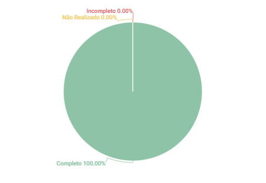

# Histórias de Usuário

## 1. Introdução
Esse artefato visa realizar a verificação do artefato de Histórias de Usuário produzido pelo Grupo 01 - Bilheteria Digital, que se encontra [nesse link](https://requisitos-de-software.github.io/2023.1-BilheteriaDigital/modelagem/agil/historia-de-usuario/). É importante lembrar que a versão do artefato que foi verificada é a versão 1.4.

## 2. Metodologia
Você pode conferir a metodologia utilizada para a verificação do Grupo 01 [nesse link](https://requisitos-de-software.github.io/2023.1-Twitch/verificacao_grupo01/planejamento/).

## 3. Verificação

A tabela 1 a seguir apresenta o checklist que orientou a verificação do Grupo 01 - Bilheteria Digital, da disciplina de Requisitos de Software no semestre 2023.01.

| ID |Questão| Resultado da Verificação |
| :---: | --- | :---: |
| 01 | O artefato possui introdução.  | Completo |
| 02 | O artefato possui histórico de versionamento completo (datas, descrição, autores, versão).  | Completo |
| 03 | O artefato apresenta as referências utilizadas na sua produção.  | Completo |
| 04 | O artefato apresenta a metodologia utilizada para a técnica de priorização.  | Completo |
| 05 | O artefato tem um título claro e conciso que descreva o objetivo da história | Completo |
| 06 | O artefato possui uma descrição detalhada da funcionalidade ou requisito específico do ponto de vista do usuário | Completo |
| 07 | O artefato apresenta os critérios que definem quando a história será considerada completa e atenderá às necessidades do usuário| Completo |
| 08 | O artefato estimatima do esforço necessário para implementar a história. | Completo |
| 09 | O artefato possui a identificação de quaisquer histórias de usuário, requisitos ou componentes do sistema que são necessários para implementar a história atual. | Completo |
| 09 | O artefato possui a associação da história a outros artefatos do projeto, como casos de uso, diagramas de sequência ou requisitos de sistema. | Completo |
| 09 | O artefato apresenta qualquer informação adicional relevante para a compreensão ou implementação da história, como restrições, considerações de segurança ou impacto em outras partes do sistema.| Completo |

<h6 align = "center"> Tabela 1: Checklist para Verificação
  Autor(es): Ana Beatriz
 Fonte: Autor(es)</h6>

## 4. Resultados
A imagem 1 a seguir apresenta um gráfico de pizza levando em consideração as 9 questões utilizadas para verificação do artefato Histórias de Usuário:

<h6 align = "center"> Imagem 1: Resultados da Verificação das Histórias de Usuário
  Autor(es): Ana Beatriz
 Fonte: Autor(es)</h6>

Com base na verificação realizada, o artefato Histórias de Usuário parece estar completo e seguir o checklist fornecido. Ele fornece uma descrição detalhada das histórias de usuário, incluindo critérios de aceitação e prioridades, além de mencionar a metodologia utilizada para sua elicitação.

## Referências
> PRESSMAN, Roger S.; 1-MAXIM, Bruce R.. Engenharia de software: uma abordagem profissional. 8 Porto Alegre: AMGH, 2016, 940 p.

>SERRANO, Milene. Requisitos – Aula 15. 2017. Apresentação de slides. Disponível em: https://aprender3.unb.br/pluginfile.php/2523115/mod_resource/content/1/Requisitos%20-%20Aula%2015a.pdf. Acesso em: 20/05/2023.

>Bourque, P., Fairley, R. E. Guide to the Software Engineering Body of Knowledge, Version 3.0. SWEBOK. IEEE Computer Society, 2014. Disponível em: http://www.computer.org/web/swebok/v3. p. 38.

## Histórico de Versões

A Tabela 3 registra o histórico de versão desse documento.

|**Data** | **Versão** | **Descrição** | **Autor** | **Revisor** |
|:---: | :---: | :---: | :---: | :---: |
| 13/06/2023| 1.0 | Criação do documento | Ana Beatriz | Matheus |
| 14/06/2023| 1.1 | Adição da introdução e ajuste na metodologia | Ana Beatriz | Matheus |
| 29/06/2023 | 2.0 | Padronização do documento |  Ana Beatriz  | Matheus |

<h6 align = "center"> Tabela 3: Histórico de Versões
  Autor(es): Ana Beatriz
 Fonte: Autor(es)</h6>

